<div align="center">

[LOGO APLICACIÓN — sustituir por el logo real de Emotiva Poli]

# EMOTIVA POLI

### *El polideportivo que late con cada reserva*

---

**CFGS DAW**
**Módulo Profesional: Proyecto Intermodular Desarrollo de Aplicaciones Web**
**IES L'Estació**
**Curso 2025-26**

---

**Alumno:** Alex Seguí Guerola
**Tutora:** Yolanda Monerris

</div>

---

## Índice

1. [Introducción](#1-introducción)
   1.1. [Idea de negocio](#11-idea-de-negocio)
   1.2. [Objetivos](#12-objetivos)
   1.3. [Análisis del mercado y segmentación. Competencia. DAFO](#13-análisis-del-mercado-y-segmentación-competencia-dafo)
   1.4. [Alineación con objetivos, valores, sostenibilidad y futuro (ODS)](#14-alineación-con-objetivos-valores-sostenibilidad-y-futuro-ods)
2. [Análisis de los requerimientos](#2-análisis-de-los-requerimientos)
   2.1. [Entidad-Relación](#21-entidad-relación)
   2.2. [Diagrama de clases y casos de uso](#22-diagrama-de-clases-y-casos-de-uso)
   2.3. [Diseño](#23-diseño)
   2.4. [Tecnologías](#24-tecnologías)
   2.5. [Planificación](#25-planificación)
3. [Implementación](#3-implementación)
   3.1. [Despliegue](#31-despliegue)
   3.2. [Backend](#32-backend)
   3.3. [Frontend](#33-frontend)
   3.4. [Diseño](#34-diseño)
4. [Mejoras futuras](#4-mejoras-futuras)
5. [Conclusiones](#5-conclusiones)
   5.1. [Personales](#51-personales)
   5.2. [Técnicas](#52-técnicas)
6. [Referencias bibliográficas](#6-referencias-bibliográficas)

---

## 1. Introducción

### 1.1. Idea de negocio

**Emotiva Poli** es una plataforma web integral de gestión y reserva de instalaciones deportivas pensada para polideportivos municipales, ayuntamientos y centros deportivos privados. La aplicación permite a cualquier ciudadano consultar las pistas disponibles, reservarlas en tiempo real con pago seguro mediante tarjeta, inscribirse en clases dirigidas (yoga, pilates, pádel, etc.) y unirse a clubs deportivos con cuotas mensuales.

Por el otro lado, el personal del polideportivo dispone de un **panel de administración** desde el que gestiona pistas, reservas, calendario semanal con vista por recursos, usuarios, clases, clubs, pagos e incidencias reportadas por los propios clientes.

La plataforma incorpora un módulo de **inteligencia artificial** que entiende lenguaje natural ("quiero una pista cubierta de pádel barata para esta tarde") y devuelve las pistas más relevantes, mejorando la experiencia frente a un buscador de filtros tradicional.

<!-- 📌 Pega aquí la captura 1 (Ctrl+V) -->
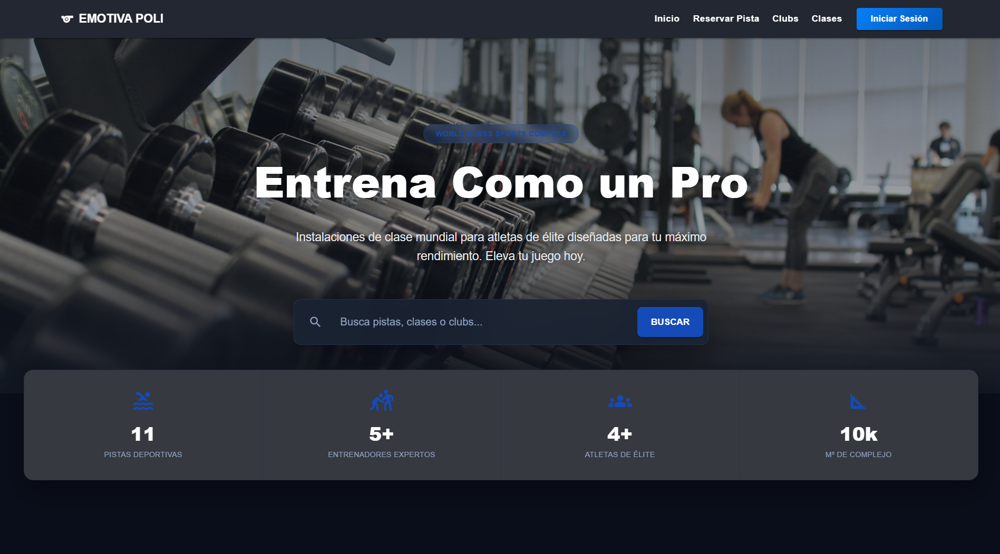
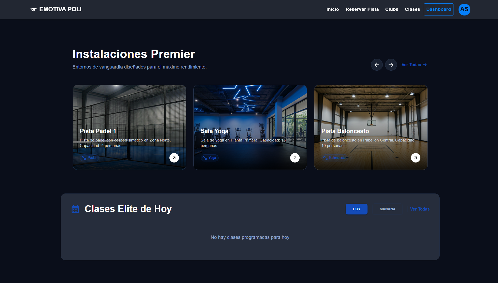
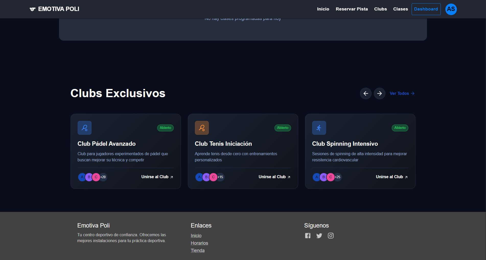
*Captura 1 — Página de inicio con la sección hero y las pistas destacadas.*

### 1.2. Objetivos

Los objetivos del proyecto se han dividido en tres bloques: funcionales, técnicos y formativos.

**Objetivos funcionales**
- Permitir al usuario registrarse, iniciar sesión y mantener la sesión segura entre dispositivos.
- Listar y buscar pistas, clases y clubs con filtros y búsqueda asistida por IA.
- Reservar pistas y pagar con tarjeta de forma segura mediante Stripe.
- Inscribirse en clases con control de aforo y lista de espera automática.
- Suscribirse a clubs con cobros mensuales recurrentes.
- Reportar incidencias desde la propia aplicación.
- Ofrecer un panel de administración completo para el personal del polideportivo.

**Objetivos técnicos**
- Diseñar una arquitectura **multiservicio** (Spring Boot, FastAPI, Next.js, React) totalmente contenedorizada con Docker Compose.
- Implementar autenticación robusta con **JWT + refresh token** en cookie HttpOnly y contraseñas con **Argon2**.
- Integrar pasarela de pagos real (**Stripe**) con webhooks y garantía de idempotencia.
- Garantizar consistencia en operaciones críticas (reservas) mediante **transacciones SERIALIZABLE**.
- Tipado estricto en frontend (TypeScript) y validación de datos en backend (Bean Validation).
- Migraciones de base de datos versionadas con **Flyway**.

**Objetivos formativos**
- Aplicar **arquitectura hexagonal / clean architecture** (presentación, aplicación, dominio, infraestructura) tanto en Spring Boot como en FastAPI.
- Conocer y comparar dos ecosistemas backend distintos (Java/Spring y Python/FastAPI) construyendo sobre la misma base de datos.
- Practicar despliegue real con Docker, Nginx y reverse proxies.
- Trabajar con LLMs (Groq, Gemini, OpenRouter) y patrones modernos como **RAG** (Retrieval-Augmented Generation).

### 1.3. Análisis del mercado y segmentación. Competencia. DAFO

#### Mercado y segmentación

El sector del *deporte como servicio* está en pleno crecimiento. Cada vez más ayuntamientos digitalizan sus polideportivos para reducir las colas en taquilla y los pagos en efectivo. Emotiva Poli se dirige principalmente a:

| Segmento | Necesidad principal |
|---|---|
| Ayuntamientos y polideportivos municipales | Reservas online, control de aforo, trazabilidad de pagos |
| Clubs privados (pádel, tenis, *fitness*) | Suscripciones recurrentes y gestión de socios |
| Usuarios particulares | Reservar rápido, sin descargas, desde el móvil |
| Entrenadores | Publicar sus clases y gestionar inscripciones |

#### Competencia

Existen plataformas consolidadas como **Playtomic**, **MatchPoint** o **Resasports**, orientadas sobre todo a clubs privados y centradas en pádel/tenis. Emotiva Poli se diferencia en tres puntos:

1. **Enfoque municipal**: pensado para polideportivos públicos con múltiples deportes en una misma instalación.
2. **Búsqueda con IA en lenguaje natural**, en lugar de filtros rígidos.
3. **Open stack**: el ayuntamiento puede desplegarlo en su propia infraestructura con un único `docker compose up`.

#### Análisis DAFO

|   | **Internas** | **Externas** |
|---|---|---|
| **Positivas** | **Fortalezas**<br/>- Arquitectura multiservicio modular<br/>- Pago integrado con Stripe<br/>- Búsqueda IA con *fallback* multi-proveedor<br/>- Despliegue con Docker en un solo comando<br/>- Tipado estricto (TypeScript + Java) | **Oportunidades**<br/>- Digitalización del deporte municipal<br/>- Crecimiento de los pagos *contactless*<br/>- Auge de los servicios *self-hosted* en ayuntamientos<br/>- Demanda de personalización con IA |
| **Negativas** | **Debilidades**<br/>- Producto en fase MVP, sin tests de carga reales<br/>- Sin app móvil nativa (sólo PWA potencial)<br/>- Curva de aprendizaje para administradores no técnicos | **Amenazas**<br/>- Competidores ya establecidos en clubs privados<br/>- Cambios regulatorios en pagos online (PSD2, SCA)<br/>- Dependencia de proveedores externos (Stripe, LLMs) |

### 1.4. Alineación con objetivos, valores, sostenibilidad y futuro (ODS)

Emotiva Poli contribuye a varios **Objetivos de Desarrollo Sostenible** de la Agenda 2030 de la ONU:

| ODS | Cómo contribuye Emotiva Poli |
|---|---|
| **ODS 3 — Salud y bienestar** | Facilita el acceso al deporte, reduce barreras administrativas y promueve clases dirigidas. |
| **ODS 9 — Industria, innovación e infraestructura** | Moderniza la infraestructura municipal con tecnología actual y patrones de IA. |
| **ODS 10 — Reducción de desigualdades** | Al ser apto para polideportivos municipales, democratiza el acceso al deporte. |
| **ODS 11 — Ciudades sostenibles** | Reduce desplazamientos innecesarios (no hay que ir a la taquilla a reservar) y digitaliza procesos. |
| **ODS 12 — Producción y consumo responsable** | Elimina papel: tickets, justificantes y facturas son electrónicos. |

**Valores del proyecto**: accesibilidad, transparencia (cualquier usuario puede ver pistas y clases sin registrarse), seguridad (Argon2, JWT, cookies HttpOnly, *idempotencia* en pagos) y sostenibilidad técnica (código mantenible, arquitectura por capas, migraciones versionadas).

---

## 2. Análisis de los requerimientos

### 2.1. Entidad-Relación

El sistema gira en torno a **trece entidades principales** persistidas en PostgreSQL. La gestión completa del esquema se realiza desde Spring Boot mediante JPA/Hibernate, con migraciones versionadas en **Flyway** (`src/main/resources/db/migration`).

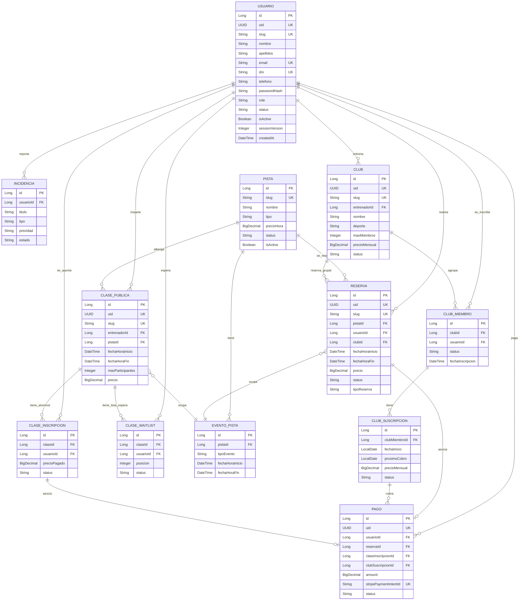

> Nota: la entidad `EventoPista` actúa como tabla agregadora del calendario y previene solapes entre reservas, clases y bloqueos por mantenimiento.

### 2.2. Diagrama de clases y casos de uso

#### Diagrama de clases simplificado (capa de dominio Spring Boot)

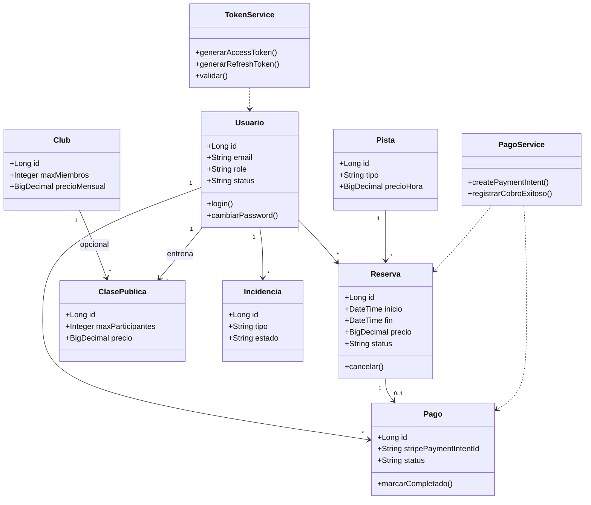

#### Diagrama de casos de uso

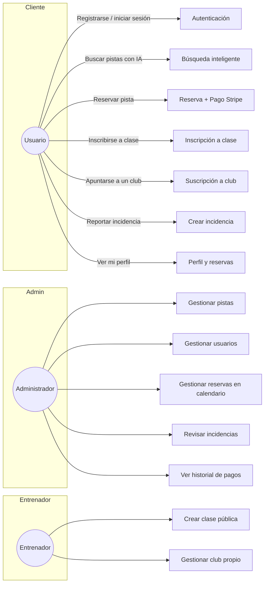

### 2.3. Diseño

#### 2.3.1. Mockups

A continuación, se incluyen las capturas de pantalla más representativas de la aplicación, agrupadas por área funcional. El resto de pantallas (registro, recuperar contraseña, catálogos de clases y clubs, incidencias, etc.) siguen el mismo patrón visual y de navegación que las que se muestran aquí.

**Autenticación**

<!-- 📌 Pega aquí la captura 2 (Ctrl+V) -->
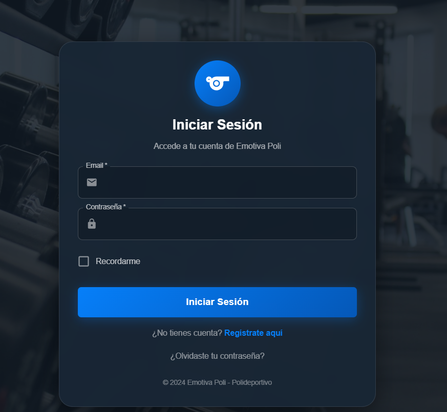
*Captura 2 — Formulario de inicio de sesión. La validación se hace en el frontend con TypeScript y en el backend con Bean Validation.*

**Catálogo de pistas con búsqueda IA**

<!-- 📌 Pega aquí la captura 3 (Ctrl+V) -->
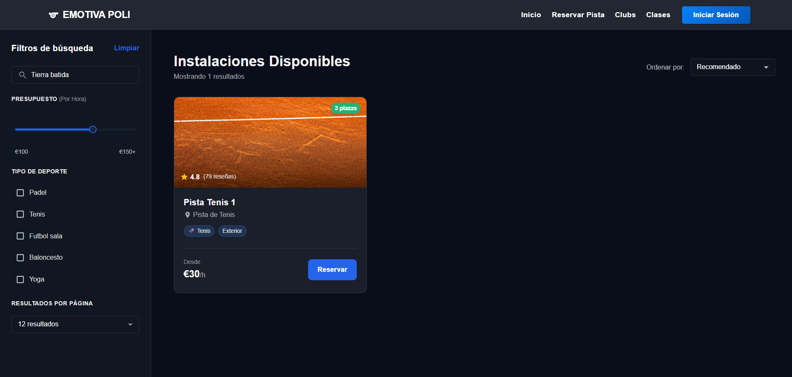
*Captura 3 — Página `/shop` con filtros, paginación y búsqueda en lenguaje natural alimentada por el IA Gateway (Groq/Gemini/OpenRouter).*

**Reserva y pago con Stripe**

<!-- 📌 Pega aquí la captura 4 (Ctrl+V) -->
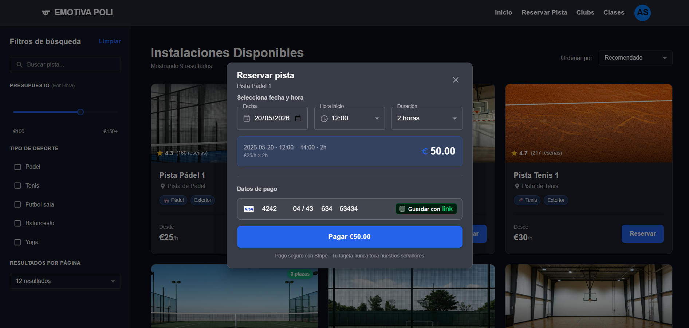
*Captura 4 — Modal `ModalReservaPago` con `<CardElement>` de Stripe. Los datos de tarjeta nunca pasan por nuestro servidor.*

**Perfil de usuario**

<!-- 📌 Pega aquí la captura 5 (Ctrl+V) -->
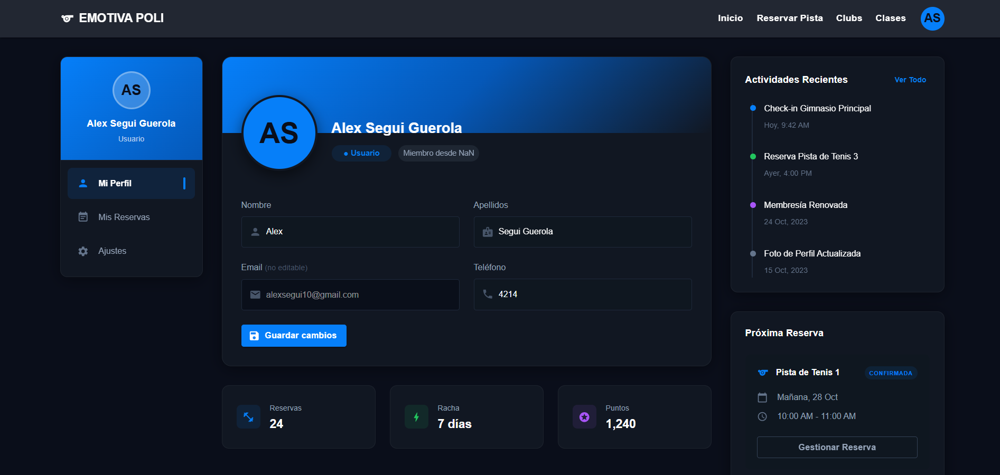
*Captura 5 — Vista de perfil con pestañas: información, mis reservas y ajustes.*

**Panel de administración**

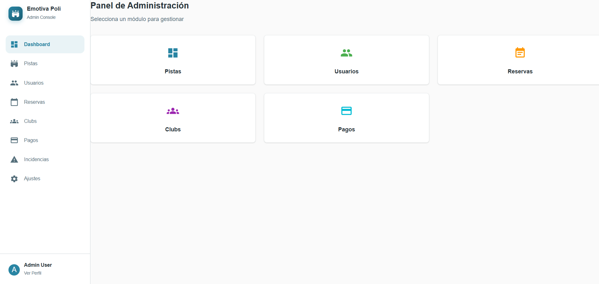
*Captura 6 — Dashboard de administración con accesos rápidos a los módulos CRUD.*

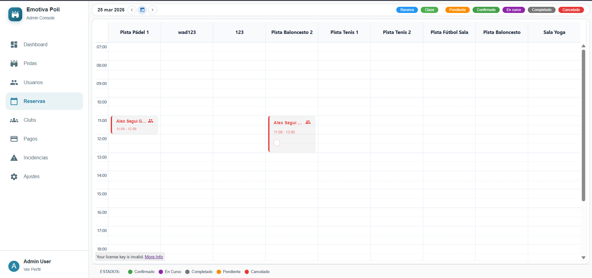
*Captura 7 — Calendario FullCalendar con vista por recursos (pistas como columnas) y eventos arrastrables.*

#### 2.3.2. Paleta de colores

La paleta se define en un único punto del frontend (`react_client/src/theme/theme.ts`) usando `createTheme` de Material UI, lo que garantiza coherencia visual en toda la aplicación.

| Rol | Color | HEX | Uso principal |
|---|---|---|---|
| Primario | Azul corporativo | `#1565c0` | Botones, enlaces, encabezados |
| Primario claro | Azul medio | `#1976d2` | Hover, *highlights* |
| Primario oscuro | Azul profundo | `#0d47a1` | Cabeceras y *focus* |
| Secundario | Gris azulado | `#455a64` | Texto secundario, *chips* |
| Éxito | Verde | `#43a047` | Confirmaciones, estados "completado" |
| Error | Rojo | `#e53935` | Errores y avisos críticos |
| Aviso | Naranja | `#fb8c00` | Advertencias y estados pendientes |
| Información | Azul claro | `#1e88e5` | Notificaciones informativas |
| Fondo (default) | Gris claro | `#f5f7fa` | Fondo general de la app |
| Fondo (paper) | Blanco | `#ffffff` | Tarjetas y diálogos |
| Texto primario | Antracita | `#263238` | Cuerpo de texto |
| Texto secundario | Gris medio | `#546e7a` | Subtítulos y *captions* |
| Divisor | Gris suave | `#cfd8dc` | Separadores |

**Tipografía:** Inter como fuente principal, con *Roboto*, *Helvetica* y *Arial* como *fallback*. Tamaños desde 0,875 rem (cuerpo pequeño) hasta 2,75 rem (H1). *Border-radius* global de 8 px y botones sin transformación a mayúsculas (`textTransform: 'none'`) para un aspecto más cercano y moderno.

#### 2.3.3. Usabilidad

Se han aplicado los siguientes principios de usabilidad:

- **Diseño responsive**: el sistema de Grid de MUI adapta el contenido a móvil, tablet y escritorio.
- **Feedback inmediato**: peticiones gestionadas con React Query muestran *spinners*, los errores se traducen a alertas de SweetAlert2.
- **Coherencia visual**: paleta única y componentes reutilizables (`FormField`, `FormSelect`, `CampoFormulario`).
- **Rutas protegidas**: `AuthGuard` y `AdminGuard` redirigen automáticamente sin sesión o sin rol.
- **Lazy loading** de páginas con `React.lazy + Suspense` para reducir el *bundle* inicial.
- **Modo oscuro** en páginas clave (Home, Shop, Perfil) creando un *theme* secundario.
- **Multi-pestaña**: si el usuario tiene varias pestañas abiertas, el `BroadcastChannel` sincroniza login/logout y refresh de token.
- **Búsqueda con debounce** para no saturar el servidor mientras el usuario escribe.

### 2.4. Tecnologías

Esta sección describe **qué** tecnologías se han usado y **por qué** se han elegido. La sección 3 cuenta cómo se han implementado.

#### 2.4.1. Despliegue

<p align="center">
 &nbsp;
 &nbsp;
 &nbsp;
 &nbsp;

</p>

| Tecnología | Versión | Para qué se ha usado |
|---|---|---|
| **Docker + Docker Compose** | última | Empaquetar los 5 servicios y la BD en contenedores reproducibles |
| **PostgreSQL** | 15-alpine | Base de datos relacional única, compartida por Spring Boot y FastAPI |
| **pgAdmin 4** | latest | Cliente web para inspección y debugging de la BD durante el desarrollo |
| **Nginx** | alpine | Servir el bundle de React en producción y *proxy* a los backends |
| **Git + GitHub** | — | Control de versiones |

> **Lo que más me ha gustado del despliegue**
> Docker Compose me ha sorprendido por lo limpio que queda todo. Con un único `docker compose up` arrancan PostgreSQL, pgAdmin, Spring Boot, FastAPI, Next.js y React totalmente conectados por una red interna (`emotivapoli_network`). Antes de aprenderlo, esto me costaba media tarde montar a mano. Además, los `healthcheck` de Postgres bloquean el arranque del backend hasta que la BD está realmente lista — un detalle pequeño pero que evita errores absurdos en frío.

#### 2.4.2. Backend

<p align="center">
 &nbsp;
 &nbsp;
 &nbsp;
 &nbsp;
 &nbsp;
 &nbsp;

</p>

**Backend principal — Spring Boot 3.2.1 / Java 17**

| Componente | Para qué |
|---|---|
| **Spring Web MVC** | API REST con anotaciones `@RestController` |
| **Spring Data JPA + Hibernate** | ORM y repositorios sobre PostgreSQL |
| **Spring Security 6** | Filtros, autorización por método y por ruta |
| **JJWT 0.12.5** | Generación y validación de Access Token y Refresh Token |
| **Argon2 (BouncyCastle)** | Hashing de contraseñas mucho más resistente que bcrypt |
| **Stripe Java SDK 25.3.0** | Crear PaymentIntents y verificar webhooks |
| **Flyway** | Migraciones de base de datos versionadas |
| **dotenv-java** | Cargar variables de entorno desde un `.env` |
| **SpringDoc OpenAPI** | Generar Swagger UI automáticamente |
| **Maven 3.9** | Sistema de *build* |

**Backend auxiliar — FastAPI 0.115 / Python 3.11**

Microservicio de **lectura** que expone catálogos rápidos de pistas, clases y clubs sobre la **misma base de datos** que Spring Boot. Aporta:

- **SQLAlchemy 2.0 + psycopg 3** como ORM.
- **Pydantic 2** para validar y documentar respuestas.
- **Uvicorn** como servidor ASGI.
- Documentación interactiva automática en `/docs` (Swagger) y `/redoc`.

> **Lo que más me ha gustado del backend**
> Lo más interesante para mí ha sido el flujo de **reserva + pago con Stripe**. Cuando un cliente paga, el `PagoService` abre una transacción `SERIALIZABLE`, valida que la pista existe y está libre, crea la reserva en `pendiente`, crea el `PaymentIntent` en Stripe y guarda su ID. Más tarde, Stripe llama al webhook `/stripe/webhook` con la firma HMAC y, si el pago se completó, marca la reserva como `confirmada`. La parte que más me costó entender — pero también la que más me ha enseñado — fue la **idempotencia**: si Stripe reenvía el evento (cosa que ocurre), la BD detecta el `stripePaymentIntentId` UNIQUE y no duplica nada. Es un patrón que se usa en empresas reales y verlo funcionando con tarjetas de prueba mola mucho.

#### 2.4.3. Frontend

<p align="center">
 &nbsp;
 &nbsp;
 &nbsp;
 &nbsp;
 &nbsp;

</p>

**Cliente principal — React 18 + TypeScript + Vite**

| Tecnología | Para qué |
|---|---|
| **React 18** | UI declarativa con componentes funcionales y hooks |
| **TypeScript 5** | Tipado estricto: errores detectados en compilación |
| **Vite 5** | Servidor de desarrollo con HMR, *bundling* optimizado y *proxy* a los backends |
| **React Router 6** | Navegación SPA, *lazy loading* de páginas |
| **TanStack Query 5** | *Caché* de datos remotos, refetch, *mutations* |
| **Axios** | Cliente HTTP con *interceptors* (inyección automática de JWT y refresh en 401) |
| **Material UI 5 + Emotion** | Sistema de diseño y *theming* |
| **FullCalendar 6** | Calendario semanal con vista por recursos (pistas) |
| **Stripe.js + React Stripe** | `<CardElement>` y `confirmCardPayment` PCI-compliant |
| **Recharts** | Gráficas en el panel admin |
| **SweetAlert2** | Modales bonitos de confirmación y error |

**IA Gateway — Next.js 16 (App Router)**

Servicio Node aparte que orquesta varios proveedores LLM (**Groq**, **Gemini**, **OpenRouter**) con un patrón **RAG**: primero filtra las pistas relevantes localmente con similitud coseno y solo después le pide al LLM una recomendación. Si un proveedor falla lo *blacklista* 2 minutos y prueba el siguiente — así el sistema no se cae si Groq se queda sin cuota.

> **Lo que más me ha gustado del frontend**
> Sin duda los **interceptors de Axios** y la **sincronización multi-pestaña**. La primera vez que vi cómo el frontend, ante un 401, llama solo a `/auth/refresh`, recoge el nuevo token, **avisa a las demás pestañas por `BroadcastChannel`** y reintenta la petición original sin que el usuario se entere, alucinaba. Es la magia que hace que una SPA *parezca* siempre logueada incluso aunque el access token caduque cada 15 minutos. Tener TypeScript marcando en rojo cualquier error antes de ejecutar también es una sensación que ya no quiero perder.

#### 2.4.4. Diseño

<p align="center">
 &nbsp;

</p>

| Herramienta | Para qué |
|---|---|
| **Figma** | Mockups y prototipos antes de codificar las páginas |
| **Material Design 3 (MUI)** | Sistema de componentes consistente, accesible y probado |
| **Inter** | Tipografía moderna, legible y gratuita |
| **Iconografía MUI** | +5000 iconos integrados, sin necesidad de SVG manuales |

> **Lo que más me ha gustado del diseño**
> Trabajar con un *theme* centralizado en MUI te ahorra muchísimo tiempo. Cambias `palette.primary.main` y todos los botones, *links* y badges se actualizan a la vez. Si lo comparas con escribir CSS plano, la diferencia en mantenimiento es enorme.

### 2.5. Planificación

#### 2.5.1. Diagrama de Gantt

La planificación se ha estructurado en **cuatro grandes bloques** durante el curso 2025-26:

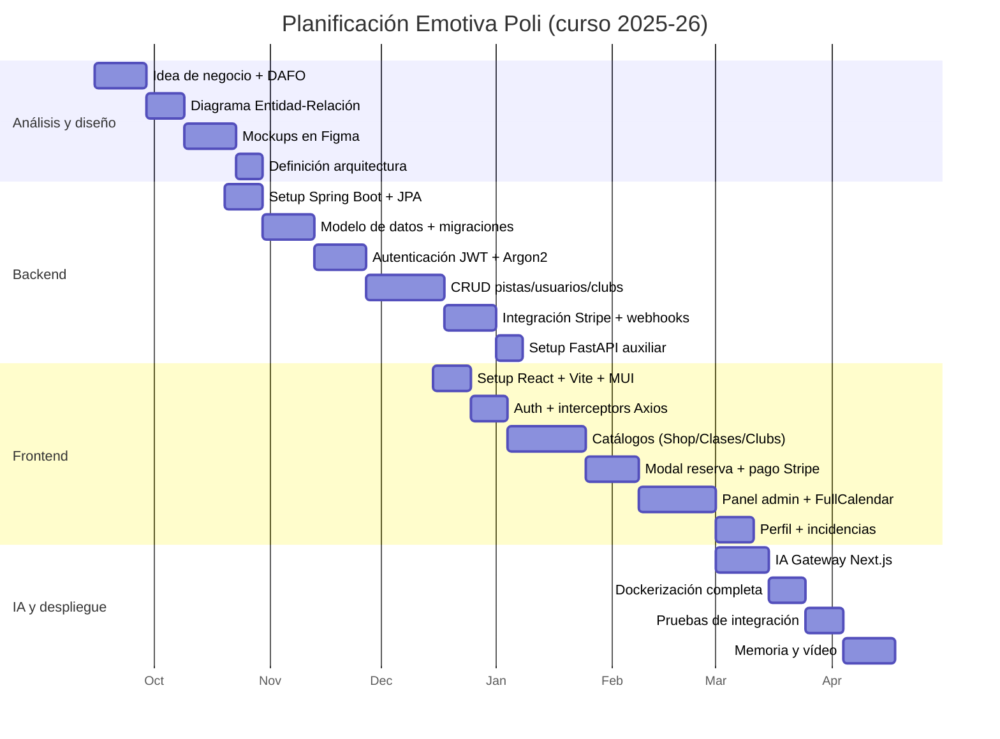

---

## 3. Implementación

### 3.1. Despliegue

Toda la plataforma se despliega con un único `docker compose up -d`. El fichero `docker-compose.yml` define **seis servicios** sobre una red interna `emotivapoli_network`.

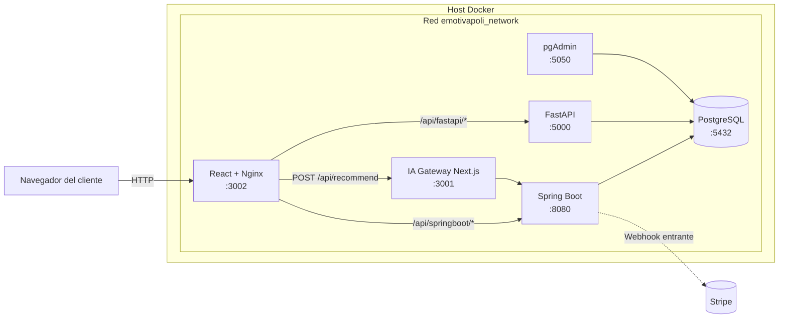

**Características destacadas del despliegue**

- **Postgres** arranca con un `init-db.sql` para datos de ejemplo y `healthcheck` con `pg_isready`.
- **Spring Boot** depende de Postgres `service_healthy` para no fallar en frío.
- **React** se compila con Vite y se sirve con Nginx en producción (multi-stage Dockerfile, ~50 MB de imagen final).
- **Variables sensibles** (claves de Stripe, secretos JWT, API keys de IA) se inyectan desde un `.env` raíz, nunca se hardcodean.
- **Volúmenes** persistentes para Postgres y pgAdmin para no perder datos al recrear los contenedores.

### 3.2. Backend

#### Spring Boot — arquitectura por capas

Cada dominio (`auth`, `usuario`, `pista`, `reserva`, `club`, `clase`, `pago`, `incidencia`, etc.) sigue la misma estructura inspirada en arquitectura hexagonal:

```
com.emotivapoli.<dominio>/
├── presentation/   ← Controllers, Routers, Request/Response
├── application/    ← Services y Mappers (lógica de aplicación)
├── domain/         ← Entities y DTOs (modelo de negocio)
└── infrastructure/ ← Repositories y Mappers de persistencia
```

**Endpoints más relevantes**

| Recurso | Método | Ruta | Acceso |
|---|---|---|---|
| Auth | POST | `/api/auth/register` | Pública |
| Auth | POST | `/api/auth/login` | Pública |
| Auth | POST | `/api/auth/refresh` | Pública (cookie) |
| Auth | POST | `/api/auth/logout` | Pública |
| Pistas | GET | `/api/pistas/search` | Pública (filtros + paginación) |
| Reservas | GET | `/api/reservas/{slug}` | Autenticado |
| Pagos | POST | `/api/pagos/create-payment-intent` | Autenticado |
| Stripe | POST | `/stripe/webhook` | Pública (firma HMAC) |
| Clases | POST | `/api/clase-inscripciones` | Autenticado |
| Incidencias | POST | `/api/incidencias` | Autenticado |
| Admin | GET | `/api/usuarios` | `ROLE_ADMIN` |

**Seguridad**

- **Access Token (JWT)**: 15 min para clientes/entrenadores, 8 h para administradores.
- **Refresh Token**: 30 días para clientes y 7 días para administradores, en **cookie HttpOnly** sólo legible por el servidor.
- **Argon2** con 32 KB de memoria, 3 iteraciones, paralelismo 1.
- **JWT Blacklist** en BD para invalidar el access token al hacer logout antes de su expiración.
- **`sessionVersion`** en `Usuario` para forzar logout global en todos los dispositivos al cambiar la contraseña.
- **`@ControllerAdvice`** centralizado en `GlobalExceptionHandler` que mapea excepciones a `409`, `404`, `400`, `422`, `401` y `500` con un cuerpo JSON estandarizado.

**Pagos con Stripe — flujo completo**

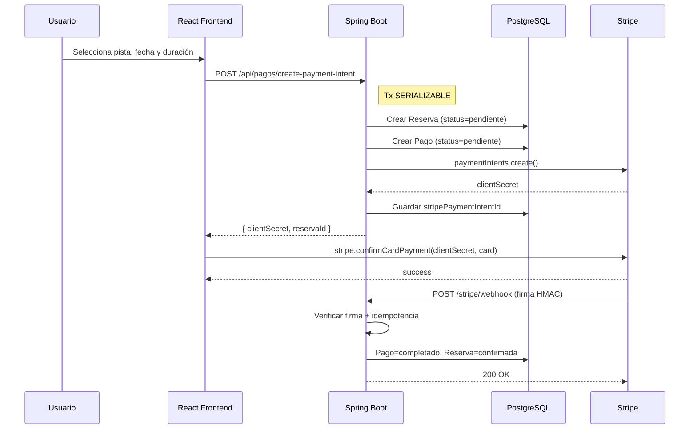

**Tareas programadas**

`ReservaSchedulerService` ejecuta cada 5 minutos (`@Scheduled(cron = "0 0/5 * * * *")`) un *job* que llama a funciones SQL en Postgres para marcar reservas y clases como `completadas` cuando ya ha pasado su hora de fin, y `canceladas` automáticamente cuando han pasado de inicio sin pago.


*Captura 9 — Documentación Swagger UI generada automáticamente por SpringDoc OpenAPI.*

#### FastAPI — microservicio de lectura

`fastapi_server` aplica la **misma arquitectura por capas** que Spring Boot: `presentation/`, `application/`, `domain/` e `infrastructure/`. Expone tres routers (`/api/pistas`, `/api/clases`, `/api/clubs`) en modo **sólo lectura**, con paginación y endpoints de estadísticas (`/stats`, `/destacadas`). Comparte la base de datos con Spring Boot mediante SQLAlchemy y nunca crea tablas (las migraciones son responsabilidad exclusiva de Flyway/Spring Boot).

**¿Por qué dos backends?** La idea era practicar dos ecosistemas distintos sobre el mismo modelo de datos y demostrar cómo se pueden coordinar. FastAPI brilla en endpoints de lectura por su rendimiento async y por la documentación automática (`/docs`).

#### IA Gateway — Next.js con RAG y multi-proveedor

El servicio `ia_gateway_next` expone un único endpoint relevante: `POST /api/recommend`. El flujo interno es:

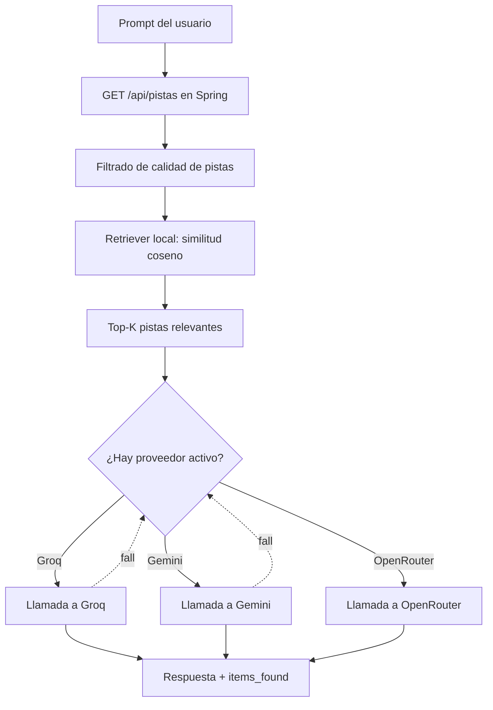

Lo más interesante a nivel didáctico: el **retriever** está hecho a mano, sin librerías de embeddings, con un *bag of words* y similitud coseno. Es suficiente para un catálogo pequeño y enseña los fundamentos de RAG sin depender de APIs externas para los embeddings.

### 3.3. Frontend

El cliente React se organiza en `pages/`, `components/`, `context/`, `hooks/`, `services/queries`, `services/mutations` y `theme/`. Cada página es un *chunk* independiente cargado bajo demanda, lo que mantiene ligera la primera carga.

**Gestión de estado**

- **`AuthContext`** mantiene `user`, `token`, `isAuth` e `isAdmin` accesibles desde cualquier componente.
- **TanStack Query** se encarga del *caché* remoto (queries) y de las operaciones de escritura (mutations). Tras una mutation, se invalidan las queries afectadas para forzar el *refetch*.

**Llamadas a las APIs**

El proxy de Vite (`vite.config.ts`) reescribe `/api/springboot/*` a `http://localhost:8080/api/*` y `/api/fastapi/*` a `http://localhost:5000/*`. En producción, Nginx hace lo mismo dentro de la red Docker. El IA Gateway se llama directamente a `http://localhost:3001/api/recommend`.

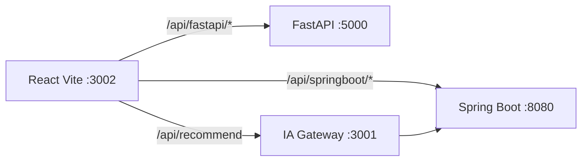

**Interceptors y refresh automático**

El cliente Axios (`apiSpring.ts`) inyecta el header `Authorization: Bearer <token>` y un `X-Device-Id`. Si el backend responde 401 y había token, llama a `/auth/refresh` (con la cookie HttpOnly), guarda el nuevo token, **lo difunde a las demás pestañas con `BroadcastChannel`** y reintenta la petición original. Si el refresh falla, se limpia el localStorage y se redirige a `/auth/login`.

**Calendario administrativo**

`CalendarioGestion.tsx` integra **FullCalendar** con vista por recursos (pistas como columnas) y tiempo (filas horarias). Permite arrastrar y soltar eventos, abrir un diálogo de detalle (`EventDetailsDialog`) y crear reservas o clases (`ModalReserva`, `ModalClase`).

**Pago con Stripe**

`ModalReservaPago.tsx` carga `stripePromise` con la clave pública (`VITE_STRIPE_PUBLIC_KEY`) y envuelve el formulario en `<Elements>`. Dentro del `CheckoutForm`, el `<CardElement>` captura la tarjeta de forma PCI-compliant, sin que los datos pasen jamás por nuestro servidor.

### 3.4. Diseño

La identidad visual se materializa con un único `theme.ts` que centraliza la paleta, la tipografía, el `borderRadius` global de 8 px, la sombra discreta de las tarjetas y el comportamiento `hover` de los botones. Los componentes propios (`FormField`, `CampoFormulario`, `UserSelector`) se construyen sobre los primitivos de MUI manteniendo coherencia.

Las páginas Home, Shop y Profile aplican un *theme* oscuro secundario (`mode: 'dark'`, fondo `#0a0e1a`) para reforzar el carácter "premium" del polideportivo y mejorar el contraste de las imágenes deportivas.

---

## 4. Mejoras futuras

Algunas líneas de evolución que planteo para iteraciones futuras:

1. **App móvil nativa** o PWA instalable, con notificaciones push para recordatorios de reserva.
2. **Tests automatizados**: actualmente se valida con `test-suite.ps1` y pruebas manuales; añadir JUnit + MockMvc en backend y Vitest + React Testing Library en frontend.
3. **CI/CD**: GitHub Actions que ejecute *lint*, tests y construya las imágenes Docker en cada *push*.
4. **Internacionalización** (i18n) con `react-i18next` para soportar valenciano e inglés además de castellano.
5. **Embeddings vectoriales reales** en el IA Gateway con `pgvector` para búsquedas semánticas más precisas.
6. **Reportes y estadísticas avanzadas** para los gestores municipales (ocupación por pista, ingresos por mes, deportes más solicitados).
7. **Roles más finos**: separar permisos a nivel de club (un entrenador sólo gestiona su propio club).
8. **Soporte multitenant**: que varios ayuntamientos compartan la misma instancia.
9. **Auditoría completa** de cambios sensibles (quién canceló qué reserva y cuándo) con `Hibernate Envers`.
10. **Accesibilidad WCAG 2.1 AA**: contraste, *aria-labels* y navegación por teclado verificadas con Lighthouse.

---

## 5. Conclusiones

### 5.1. Personales

Este proyecto ha sido el más ambicioso que he hecho durante el ciclo. Empezó como una idea relativamente sencilla — "una web para reservar pistas" — y acabó con cinco servicios coordinados por Docker, integración con Stripe y un módulo de inteligencia artificial. Por el camino he aprendido a:

- **Pensar la arquitectura antes de codificar**: dibujar el diagrama Entidad-Relación y los mockups en Figma me ahorró rehacer media aplicación.
- **No tener miedo a herramientas grandes** como Spring Security o Stripe. Documentación + ejemplos + paciencia siempre acaban funcionando.
- **Equivocarme rápido y barato**: los `healthcheck` de Docker, los logs y Swagger me daban *feedback* casi inmediato.
- **Pedir ayuda y leer código abierto**. Muchas dudas se resuelven en cuestión de minutos si uno sabe buscar.

A nivel personal, lo más satisfactorio ha sido **ver el flujo de pago completo funcionando**: el cliente paga con una tarjeta de prueba, Stripe llama al webhook, la BD actualiza la reserva y el cliente recibe la confirmación, todo en pocos segundos. Cuando vi por primera vez cambiar el estado de la reserva a "confirmada" en pgAdmin tras un pago, sentí que esto se parecía a una aplicación real.

### 5.2. Técnicas

A nivel técnico me quedo con varias conclusiones:

- **Las arquitecturas en capas valen la pena.** Aunque al principio parece sobreingeniería, separar `presentation`, `application`, `domain` e `infrastructure` me ha permitido crecer la aplicación sin que se convirtiera en un caos.
- **La seguridad no es opcional.** JWT, refresh tokens, Argon2, blacklist y `sessionVersion` son piezas que van juntas; si quitas una, dejas un agujero.
- **La idempotencia es vital en pagos.** Sin ella, un webhook reintentado por Stripe puede duplicar reservas o cobrar dos veces.
- **TypeScript en el frontend evita más errores de los que parece.** Cada vez que cambiaba un DTO en el backend, el compilador me señalaba inmediatamente las pantallas afectadas.
- **Docker Compose es la mejor manera de aprender despliegue real**. Te obliga a pensar en redes, dependencias y variables de entorno desde el primer minuto.
- **Construir un Gateway IA propio es factible.** No hace falta esperar a tener un equipo de *ML engineers*; un retriever simple y `fetch` ya te dan una experiencia muy satisfactoria.

En resumen, Emotiva Poli ha sido un proyecto exigente pero del que salgo con una caja de herramientas mucho más completa y con un producto del que estoy orgulloso de mostrar.

---

## 6. Referencias bibliográficas

- **Spring Boot Reference Documentation** — https://docs.spring.io/spring-boot/docs/current/reference/html/
- **Spring Security Reference** — https://docs.spring.io/spring-security/reference/index.html
- **JJWT (Java JWT)** — https://github.com/jwtk/jjwt
- **FastAPI Documentation** — https://fastapi.tiangolo.com/
- **SQLAlchemy 2.0 Documentation** — https://docs.sqlalchemy.org/en/20/
- **React Documentation** — https://react.dev/
- **TanStack Query Documentation** — https://tanstack.com/query/latest
- **Material UI Documentation** — https://mui.com/material-ui/
- **Vite Guide** — https://vitejs.dev/guide/
- **Next.js Documentation (App Router)** — https://nextjs.org/docs
- **Stripe Documentation — Payments** — https://stripe.com/docs/payments
- **Stripe Documentation — Webhooks & idempotency** — https://stripe.com/docs/webhooks
- **PostgreSQL 15 Documentation** — https://www.postgresql.org/docs/15/index.html
- **Docker Compose Reference** — https://docs.docker.com/compose/
- **Flyway Database Migrations** — https://documentation.red-gate.com/fd/
- **Groq API** — https://console.groq.com/docs
- **Google Gemini API** — https://ai.google.dev/gemini-api/docs
- **OpenRouter API** — https://openrouter.ai/docs
- **Mermaid Diagram Syntax** — https://mermaid.js.org/intro/
- **ODS — Agenda 2030 (ONU)** — https://www.un.org/sustainabledevelopment/es/objetivos-de-desarrollo-sostenible/

---

<div align="center">

*Memoria del Proyecto Intermodular — CFGS DAW · IES L'Estació · Curso 2025-26*

</div>
